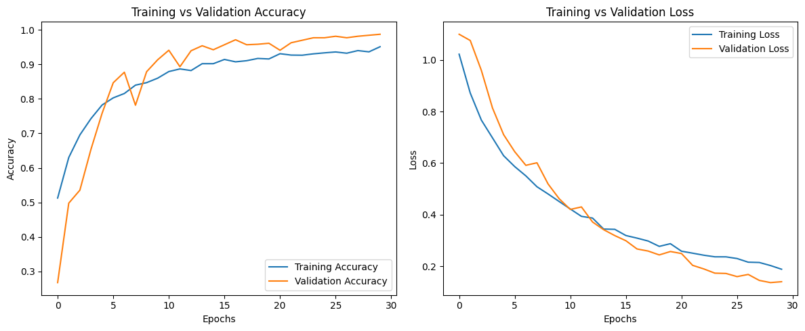

# 🌿 Indian Plant Leaves Classification using CNN

This project is a deep learning-based image classification system designed to identify **three Indian plant species** — _Madagascar Periwinkle_, _Song of India_, and _Tulsi_ — using a **Convolutional Neural Network (CNN)** trained on a dataset of leaf images.

---

## 📂 Dataset

The dataset contains **5100 images** across **3 classes**:

- `Madagascar_Periwinkle`: 891 images
- `Song_of_India`: 1668 images
- `Tulsi`: 900 images

A **train-validation split** of 80-20 was used with simple rescaling preprocessing.

---

## 🧠 Model Architecture

The CNN model includes:

- 3 Convolutional Layers with **Batch Normalization**, **Max Pooling**, and **L2 Regularization**
- **GlobalAveragePooling2D**
- Fully Connected Dense Layer (128 units + Dropout)
- Output Layer (Softmax with 3 units)

**Optimizer**: Adam  
**Loss**: Categorical Crossentropy  
**Regularization**: L2  
**Callbacks**: ReduceLROnPlateau

---

## 🔧 Training

- Trained for: **30 Epochs**
- Batch size: **16**
- Input Image Size: **224x224**

### ✅ Final Accuracy

- **Training Accuracy**: `95.09%`
- **Validation Accuracy**: `98.70%`

---

## 📈 Results

Plots for training & validation accuracy and loss:

<p align="center">
  
</p>

---

## 🌐 Web Interface (Gradio)

A simple **Gradio UI** lets you upload a leaf image and classify it in real-time.

```python
iface = gr.Interface(
    fn=predict_image,
    inputs=gr.Image(type="pil"),
    outputs="text",
    title="Indian Plant Leaves Classification",
    description="Upload an image of an indian plant leaf, and the model will predict its type."
)
iface.launch()
```
